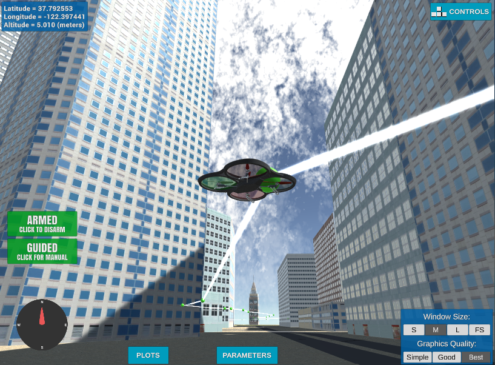

# FCND-P02-Motion-Planning


FCND-P02-Motion-Planning implements path planning for a unmanned aerial vehicle (UAV)
on simulated environment.

The communication with the UAV is done using MAVLink.  This implementation
can be used to control PX4 quadcopter autopilot with little modification.

## File Structure
### Project Source Files
* [`motion_planning.py`](motion_planning.py) - main program that interacts
with the simulator.  It creates a path from start and goal location using
modules in `planner` package and provides the resulting waypoints to the
simulator.
* [`planner/`](planner/) - implements planning algorithms
    * [`grid.py`](planner/grid.py) - implements `PlannerGrid` class. 
      `PlannerGrid` creates grid representation of the environment (obstacles)
      and implements grid-based (pixel) A* search algorithm.
    * [`graph.py`](planner/graph.py) - implements `PlannerGraph` class.
      `PlannerGraph` builds graph representation (edges) of available
      pathways using Voronoi edge algorithm and Bresenham algorithm.
      It also implements graph-based A* search algorithm.
     * [`path.py`](planner/path.py) - implement `Path` class.
       `Path` encapsulate the resulting path of the planning solution.
       It also provides path pruning through colinearity check.
### Results and Report
* [`writeup_report.md`](writeup_report.md) - Project write-up report
* [`results/`](results/) - sample screenshots and recordings

## Getting Started
### [Download ZIP](https://github.com/gabeoh/FCND-P02-Motiong-Planning/archive/master.zip) or Git Clone
```
git clone https://github.com/gabeoh/FCND-P02-Motiong-Planning.git
```

### Setup Environment
You can set up the environment following
[FCND-Term1-Starter-Kit - Miniconda](https://github.com/udacity/FCND-Term1-Starter-Kit/blob/master/docs/configure_via_anaconda.md).
This will install following packages required to run this application.
- Miniconda
- Python

Packages included through Miniconda:
- [`Matplotlib`](https://matplotlib.org/) - Python 2D plotting library
- [`Jupyter Notebook`](http://jupyter.org/) - Open-source web application
that allows you to create and share documents that contain live code, 
equations, visualizations and narrative text
* [`UdaciDrone API`](https://github.com/udacity/udacidrone) - Udacity Drone
Python API, which provides protocol agnostic API for communicating with
a quadcopter
  - To update, `pip install --upgrade udacidrone`
* [`Visdom`](https://github.com/facebookresearch/visdom/) - A flexible tool for creating, 
organizing, and sharing visualizations of live, rich data

### Using Anaconda
**Activate** the `fcnd` environment:
#### OS X and Linux
```sh
$ source activate fcnd
```
#### Windows
Depending on shell either:
```sh
$ source activate fcnd
```
or
```sh
$ activate fcnd
```

### Download Simulator
- Download Udacity Flying Car Simulator from
[this repository](https://github.com/udacity/FCND-Simulator-Releases/releases)

### Usage

#### Run Motion Planning
First, run _**Motion Planning**_ module from Flying Car Simulator.
Then, run the following command to perform the mission flight. 
```
$ python motion_planning.py 
```

Available options:
```
$ python motion_planning.py --help
usage: motion_planning.py [-h] [--port PORT] [--host HOST] [--plot-path]
                          [--planner-type PLANNER_TYPE]
                          [--goal-latitude GOAL_LATITUDE]
                          [--goal-longitude GOAL_LONGITUDE]

optional arguments:
  -h, --help            show this help message and exit
  --port PORT           Port number
  --host HOST           host address, i.e. '127.0.0.1'
  --plot-path           Show path plot
  --planner-type PLANNER_TYPE
                        1: Grid-based, 2: Graph-based (Default: 2)
  --goal-latitude GOAL_LATITUDE
                        The latitude of the goal location (Default: 37.796)
  --goal-longitude GOAL_LONGITUDE
                        The longitude of the goal location (Default: -122.3966)
```

### Reference
* [Udacity Motion Planning Project Intro](https://github.com/udacity/FCND-Motion-Planning)

## License
Licensed under [MIT](LICENSE) License.


