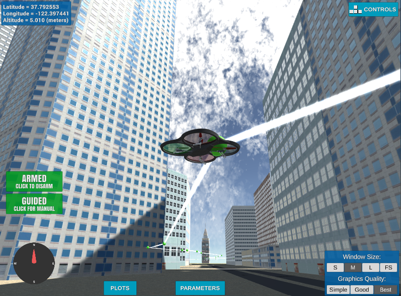

# 3D Motion Planning


---

## Objective

The goal of this project is to implement a path planner for an unmanned 
aerial vehicle (UAV) to travel from the current location to a user-specified
goal location while avoiding any obstacles in the environment.

---
## Overview of the Starter Code

### `motion_planning.py`
`MotionPlanning` class in `motion_planning.py` extends `udacidrone.Drone`
class in order to interact with Udacity Flying Car Simulator.
`MotionPlanning` registers state, local position, and velocity callback methods
in order to control the vehicle's state and movement.  These callback methods
are invoked whenever corresponding changes are detected on the vehicle.

Comparing to `backyard_flyer_solution.py`, `motion_planning.py` contains
an additional `PLANNING` flight state between `ARMING` and `TAKEOFF` states.
In the `PLANNING` state, a path from the current vehicle location to a
given goal location is calculated based on the configuration space of the
obstacles.  `backyard_flyer_solution.py`, on the other hand,
produces a simple square-shaped waypoints regardless of the operating environment.

### `planning_util.py`
`planning_util.py` provides functions used for the path planning;
`create_grid()` and `a_star()`.

`create_grid()` builds a 2-D grid representation of obstacles at given
altitude and safety distance parameters.  `a_star()` finds the shortest
path from the a start to a goal through available areas in a grid.

## Path Planning Implementation
### 1. Set global home position
The latitude (`lat0`) and longitude (`lon0`) are provided in the first line
of the `colliders.csv` file.  `set_home_position()` method is used to
set the global home position in geodetic coordinates.
```python
self.set_home_position(lon0, lat0, 0)
```

### 2. Determine the current local position
The current local position of `North, East, Altitude (NED)` can be
computed from the vehicle's global position (latitude, longitude, altitude)
using `global_to_local()` function in `udacidrone.frame_utils`
(which in turn uses functions from `utm` library).

Alternatively, `udacidrone.Drone`'s `local_position` property provides
local NED coordinates relative to the home position.  It was noticed that
there is a discrepancy between the `local_position` property and
the local coordinates computed from the global position using the
`global_to_local()` function, and that the direct `local_position` property
reflects the actual location in the simulator more accurately.

```python
self.local_position
```

### 3. Set the current location as a start position
```python
start_local = self.local_position[:]
```

### 4. Set the goal position
The main executor of `motion_planning.py` takes the latitude and longitude
of the goal location as optional arguments.  When omitted, the goal location
is set to latitude of 37.796 and longitude of -122.3966, which is a location
at the top right side of the grid.

```shell script
$ python motion_planning.py --goal-latitude=37.796 --goal-longitude=-122.3966
```

Then, the global geodetic coordinate is converted to the local NED
coordinate using `global_to_local()` function.
```python
goal_local = global_to_local(goal_global, self.global_home)
```

### 5. Grid-Based Path Finder
The data structure and related algorithms are encapsulated in the
`PlannerGrid` class of `planner` package
([`planner/grid.py`](planner/grid.py)).  A* implementation from
`planning_util.py` is extended to support diagonal movement.

The grid-based path finder algorithm can be selected by opting
`--planner-type=1` in the motion_planner runtime.
```shell script
$ python motion_planner.py --planner-type=1
```

```python
class PlannerType(Enum):
    SKIP_PLANNING=0
    GRID = 1
    GRAPH = 2
```

For the grid-based planner, collinearity check is added to prune
intermediate points in a straight line.  This simplifies the control
interface and prevents frequent stop-and-go on a straight line travel.

The following figure shows a path plan created by grid-based
planner.


### 6. Graph-Based Path Finder (Default)
The data structure and related algorithms are encapsulated in the
`PlannerGraph` class of `planner` package
([`planner/graph.py`](planner/graph.py)).  Graph edges for available
paths are created using Voronoi Edge algorithm and Bresenham's algorithm.
Then, a path from the start to the goal is constructed based on the
graph-based A* algorithm.

The graph-based path finder algorithm can be selected by opting
`--planner-type=2` in the motion_planner runtime.  Currently, the
graph-based planner is a default planner when the argument is omitted.
```shell script
$ python motion_planner.py --planner-type=1
```

The following figure shows a path plan created by graph-based
planner.


### 7. Comparison of Grid-Based and Graph Based Approach
There are pros and cons for each of the two approaches.

#### Run-Time Performance and Efficiency
In terms of the run-time performance, the graph-based approach found
a solution much faster than the grid-based approach.  In typical cases,
the graph-based planner found a solution within 5 seconds while the
grid-based solution took about a minute to find the solution in various
trials.

#### Completeness and Optimality
When a solution exists, the grid-based A* algorithm always find a
solution which is optimal for a given cost function.  The graph-based
approach, however, does not always find a solution.

The path plan figure of the graph-based planner above shows edges of
available paths created by Voronoi Edge algorithm.  This graph contains
set of disconnected edges.  The planner cannot find a path between nodes
in disconnected graphs.

The graph-based planner especially suffers to find edges through narrow
strips and at the edges of the map.  In the current implementation, only
obstacle center coordinates are passed to the Voronoi Edge algorithm.
One potential approach to enhance the planner is to include more
coordinates of the obstacles (such as corners) and map edges for the
Voronoi Edge algorithm.  This way, more edges of available paths will
be added and the planner can cover more comprehensive solution space.

#### Variations in Safety Distance
One benefit of the solution generated from the graph-based approach
is that it finds a path which is distanced from each obstacle.  In other
words, this solution naturally adds additional safety margins. 

The grid-based approach, however, finds a path much closer to obstacles
as long as it satisfies safety distance constraint.  It is possible that
the vehicle fails to execute path plan if errors exceed the safety 
margin.

There are some mismatches in the coordinates of collider map and actual
building locations in the simulator.  The vehicle cannot follow the 
desired path exactly due to its differential constraints such as 
restrictions in changing speed and direction.  In real world, weather
conditions such as wind and rain have further contribute to the errors.

On the other hand, adding too much safety distance can block certain
pathways.  This can increase the cost of the plan by blocking optimal
route.  In worse cases, it can also cause some locations unreachable.

### 8. Acceptance Radius (Deadbands)
By increasing the acceptance radius for intermediate waypoints (5m), much 
smoother flight path was achieved.  In order to ensure the vehicle
closely reaches the goal location, a separate stricter acceptance
radius constraint is applied to the goal location (0.5m).

```python
ACCEPTANCE_RADIUS = 0.5
ACCEPTANCE_RADIUS_INTERMEDIATE = 5

def is_at_target_location(self, acceptance_radius=ACCEPTANCE_RADIUS):
    """
    Check if the vehicle is within the acceptance_radius of the target location
    :param acceptance_radius:
    :return: True if the vehicle is within the acceptance radius
    """
    return np.linalg.norm(self.local_position[0:2] - self.target_position[0:2]) < acceptance_radius
```


## Flight Execution
The flight execution works well for both types of planners for default
start and goal locations.  Both planners work well for various start
and goal locations.  As discussed in the implementation section, however,
each approach has some limitations in routing through some challenging
areas such as edges of the map and narrow  strips.


### Video Recording
* [FC_MotionPlan_Recording_2019-12-09.mp4](results/FC_MotionPlan_Recording_2019-12-09.mp4)
